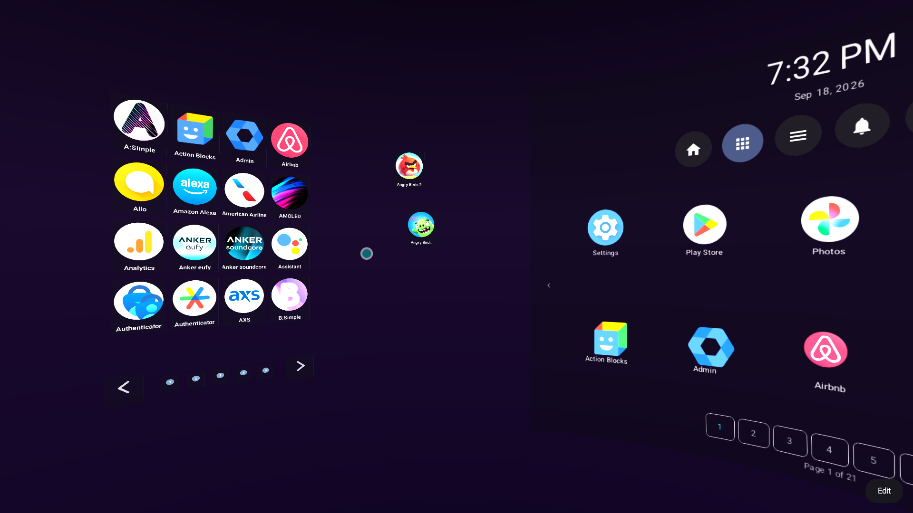
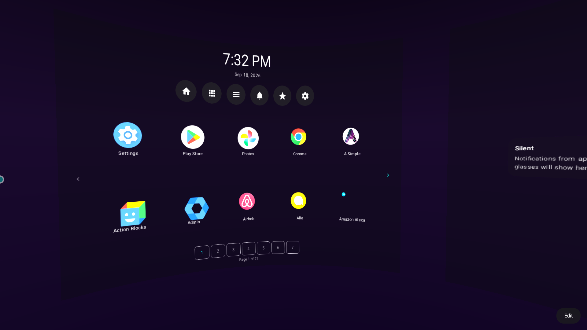
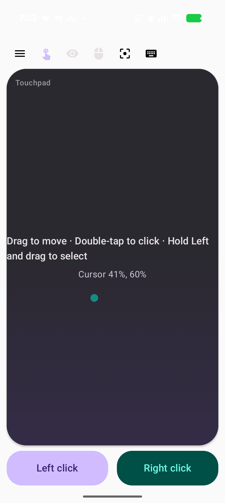

# XR Launcher

Spatial workspace launcher for Android XR glasses, headsets, and **3D desktop** on large screens (Android 14+). Your phone doubles as a **touchpad + motion controller** for the workspace.

## Status

Active development — Home Space desk (BumpDesk-style icons on the sphere), companion mouse-look, and panel launch in progress. See **[docs/PLAN.md](docs/PLAN.md)** for the roadmap.

**Latest:** `v0.1.18` — Desktop icon persistence, All Apps drawer on the sphere, companion mouse-look toggle.

**New developer?** Start with **[docs/DEVELOPER.md](docs/DEVELOPER.md)** — architecture, build, debugging, device support, and workflow.

## Screenshots

<p align="center">
  
</p>

<p align="center"><em>Glasses: Desktop All Apps drawer (left) and Home pane (right)</em></p>

<p align="center">
  
</p>

<p align="center"><em>Glasses: Home Space centered on Home</em></p>

<p align="center">
  
</p>

<p align="center"><em>Phone companion: touchpad, mouse-look toggle, Left / Right click</em></p>

## Releases

Signed APKs ship from GitHub Releases when a `v*` tag is pushed (for example `v0.1.18`). Debug APKs are built on every push to `main`.

1. Download **`app-release.apk`** from [Releases](https://github.com/electrikjesus/XR-Launcher/releases).
2. Install with `adb install -r app-release.apk`. Optionally set **XR Launcher** as Home.

[Obtainium](https://github.com/ImranR98/Obtainium) can track this repo: source GitHub, repository `electrikjesus/XR-Launcher`, APK filter `app-release.apk`.

CI matches the other Bass Android apps ([GameNative-x64](https://github.com/Bliss-Bass/GameNative-x64), [BlissDeck](https://github.com/Bliss-Bass/BlissDeck)):

| Workflow | When |
|----------|------|
| **Verify Build** | push/PR to `main`: `assembleDebug` + unit tests |
| **Compile Debug APK** | push to `main`, or run manually: uploads `app-debug.apk` |
| **Compile Release APK** | manual: signed `app-release.apk` |
| **Create Release** | `v*` tag: signed release APK, debug APK, and notes |

Signed jobs need repository Actions secrets: `SIGNING_KEY`, `SIGNING_STORE_PASSWORD`, `SIGNING_KEY_ALIAS`, `SIGNING_KEY_PASSWORD`. Generate a keystore off-tree and upload those secrets with:

```bash
.github/scripts/create-release-keystore.sh
```

That writes `~/.xr-launcher-keys/` (back that up) and calls `gh secret set` on `electrikjesus/XR-Launcher`. See `keystore.properties.example` for a manual local signed build.

## Build

```bash
./gradlew build testDebugUnitTest
```

Install debug APK: `app/build/outputs/apk/debug/app-debug.apk`

## Documentation

| Doc | Contents |
|-----|----------|
| [docs/DEVELOPER.md](docs/DEVELOPER.md) | Architecture, input system, debugging, key files |
| [docs/PLAN.md](docs/PLAN.md) | Phases, tasks, rules, git workflow |
| [docs/device-matrix.md](docs/device-matrix.md) | Hardware test results and quirks |

## Development workflow

- One plan task per branch (`dev/phase1-1.3-…`) and per commit
- Validate with `./gradlew build` and unit tests before committing
- Tag stable milestones on `main` (e.g. `v0.1.18`)

## Modes

| Mode | When | Input |
|------|------|-------|
| **Tier 0 — Spatial desktop** | Large screen, no glasses | Mouse, touch, keyboard |
| **Tier 0c — Phone shell** | Phone only, no glasses | Touch; opens companion when controlling workspace |
| **Tier 1–3 — XR workspace** | Glasses or spatial headset | Phone touchpad + motion; optional head-mouse on glasses |
| **Companion** | Phone controlling remote workspace | Touchpad + motion pointer |

## Hardware focus

- RayNeo Air 4 Pro (wired display / projected glasses path)
- Tablets & large-screen Android (3D spatial desktop fallback)
- Phone as companion controller (touchpad + gyro pointer)
- Future Android XR headsets (Full Space spatial path)

## References

- [Android xr-codelabs](https://github.com/android/xr-codelabs)
- [Android xr-samples](https://github.com/android/xr-samples)
