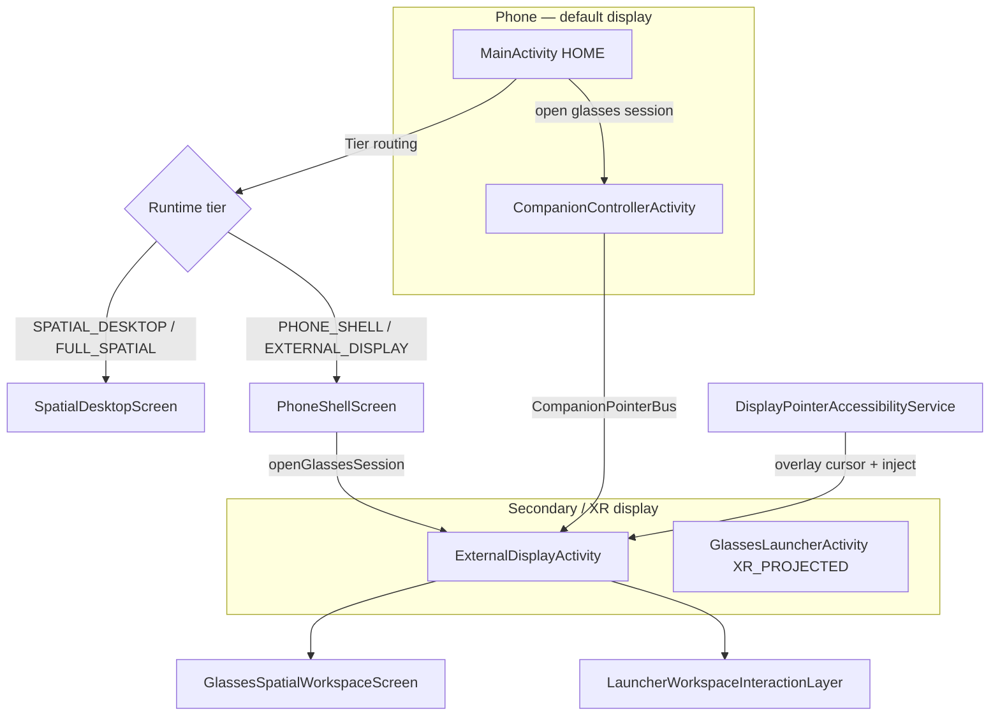

# XR Launcher — Developer Guide

Spatial workspace launcher for Android XR glasses, large screens, and phone-as-controller setups. This document covers how to build, run, debug, and extend the project.

For product goals, phased roadmap, and implementation rules, see **[PLAN.md](PLAN.md)**. For hardware-specific findings, see **[device-matrix.md](device-matrix.md)**.

---

## Quick start

### Prerequisites

| Requirement | Version / notes |
|-------------|-----------------|
| JDK | 17 |
| Android SDK | compileSdk **36**, minSdk **34** |
| Gradle | Wrapper included (`./gradlew`) |
| IDE | Android Studio Ladybug+ recommended |

### Build & test

```bash
./gradlew build testDebugUnitTest
```

Debug APK (sideload manually):

```text
app/build/outputs/apk/debug/app-debug.apk
```

### First run (RayNeo / secondary display)

1. Install the debug APK on a phone connected to glasses (Desktop Mode / wired display).
2. Set **XR Launcher** as the default HOME launcher (optional but typical).
3. From the phone shell, open **Glasses workspace** — launches `ExternalDisplayActivity` on the secondary display and `CompanionControllerActivity` on the phone.
4. Enable **Settings → Accessibility → XR Launcher display pointer** for unified cursor + inject on the glasses display.
5. Use the phone touchpad (bottom half) and **Left / Right Click** buttons to drive the workspace on glasses.

---

## Repository layout

```text
xrlauncher/
├── app/                          # Main launcher APK
│   └── src/main/java/.../
│       ├── core/                 # Business logic (no Compose UI)
│       ├── ui/                   # Jetpack Compose screens & components
│       ├── external/             # Glasses display activity
│       ├── companion/            # Phone controller activity
│       ├── glasses/              # XR_PROJECTED entry (future headsets)
│       ├── accessibility/        # Pointer overlay + gesture inject service
│       └── settings/
├── embed-test-app/               # Minimal app for activity-embedding tests
├── docs/
│   ├── PLAN.md                   # Roadmap, rules, git workflow
│   ├── device-matrix.md          # Hardware test results
│   └── DEVELOPER.md              # This file
└── gradle/libs.versions.toml     # Version catalog
```

### Module roles

| Module | Purpose |
|--------|---------|
| `:app` | HOME launcher, spatial workspace, companion controller, accessibility pointer |
| `:embed-test-app` | Target app with `allowUntrustedActivityEmbedding` for panel embed spike |

---

## Architecture overview

The app is a **single APK** with multiple activities. Runtime behavior is chosen by **capability tier**, not hard-coded device checks.



### Capability tiers

Resolved in `CapabilityLogic` / `CapabilityDetector`:

| Tier | Typical device | Primary UI |
|------|----------------|------------|
| `SPATIAL_DESKTOP` | Tablet, DeX, unfolded foldable | `SpatialDesktopScreen` — 3D workspace on host display |
| `PHONE_SHELL` | Phone alone | `PhoneShellScreen` — compact app list + glasses launch |
| `EXTERNAL_DISPLAY` | Phone + wired/projected display (RayNeo Desktop Mode) | Phone shell + `ExternalDisplayActivity` on glasses |
| `PROJECTED_GLASSES` | Android XR projected context without spatial API | `GlassesLauncherActivity` path (when available) |
| `FULL_SPATIAL` | Android XR with spatial API | Subspace shell (spike; not primary on RayNeo today) |

Tier selection rules live in `core/capability/CapabilityLogic.kt`. Window width can promote `PHONE_SHELL` → `SPATIAL_DESKTOP` when expanded.

### Activities

| Activity | Display | Role |
|----------|---------|------|
| `MainActivity` | Default | HOME entry; tier routing via `XRLauncherApp` |
| `CompanionControllerActivity` | Phone | Touchpad, motion/head tracking toggles, session controls |
| `ExternalDisplayActivity` | Secondary (`EXTERNAL`) | **Primary RayNeo path** — flat/spatial workspace on glasses |
| `GlassesLauncherActivity` | `XR_PROJECTED` | Future projected-launcher entry; requires `XR_PROJECTED` display category |
| `SettingsActivity` | Phone | Grid size, head-tracking calibration, accessibility link |

---

## Core systems

### Workspace model

Shared across tiers. Persisted via `WorkspaceRepository` (DataStore JSON).

| Concept | Location | Notes |
|---------|----------|-------|
| `Workspace`, `PanelState`, `PanelBounds` | `core/workspace/WorkspaceModels.kt` | Panel layout, visibility, hosts |
| Layout presets | `core/workspace/WorkspaceLayoutPresets.kt` | Standard / Single / Dual / Triptych |
| Appearance | `core/workspace/WorkspaceAppearance.kt` | UI scale, wrap curvature, wallpaper |
| Context menus | `core/workspace/LauncherContextMenuState.kt` | Right-click pin / panel actions |

Panels include widgets (clock, calendar), app drawer, hotseat, and empty slots for app launch.

### App launch

`WorkspaceAppLaunchCoordinator` → `PanelAppLauncher`:

1. Prefer spatial embed when `SpatialEmbedCapability` allows (`PanelEmbedRegistry`).
2. Fall back to full-window launch on target display via `AppLauncher.launchOnDisplay`.
3. On glasses, launching an app calls `moveTaskToBack` and sets `GlassesSessionState.markLauncherBackgrounded()`.

### Input: phone → glasses

All cross-surface pointer state flows through **`CompanionPointerBus`** (`core/input/CompanionPointerBus.kt`):

| State / API | Purpose |
|-------------|---------|
| `cursor` | Normalized (0..1) position + pressed + hover label |
| `moveBy` / `emit` | Touchpad deltas from companion |
| `click` / `deliverLeftClick` | Left/right click routing |
| `applyGlassesImuSample` | RayNeo USB gyro → cursor on launcher |
| `glassesControlMode` | `LAUNCHER` vs `DESKTOP` (accessibility-driven) |

**Click routing (glasses):**

```text
Companion touchpad / buttons
        ↓
CompanionPointerBus.deliverLeftClick
        ↓
   launcherBackgrounded?
    /              \
  yes              no
   ↓                ↓
DisplayPointer   Compose hit-test
Injector         (LauncherWorkspacePointerEffects)
(accessibility)   via registered click listeners
```

Important session flags in `GlassesSessionState`:

- `launcherForeground` — launcher is interactive on glasses (not cleared on `onStop`; phone can steal focus while glasses still show launcher).
- `launcherBackgrounded` — user launched another app; inject path active, return bubble shown.
- `launcherInjectFrame` — window bounds on glasses display for mapping overlay cursor and inject coords.

### Accessibility pointer service

`DisplayPointerAccessibilityService` (user must enable in Settings):

- Draws passthrough cursor overlay on glasses display (`DisplayCursorOverlayManager`).
- Injects taps/drags via `dispatchGesture` + `setDisplayId`.
- Shows return-to-launcher bubble when `launcherBackgrounded`.

Without accessibility: in-app `ExternalCursorDot` + Compose-only hit-testing.

### Compose hit-testing (launcher foreground)

`LauncherWorkspaceInteractionLayer` registers pointer effects:

| Component | Handles |
|-----------|---------|
| `LauncherWorkspacePointerEffects` | App launch, settings, all-apps, layout presets, pagination |
| `PanelChromePointerEffects` | Panel minimize / close / restore |
| `PanelHandlePointerEffects` | Panel drag / resize handles |
| `WorkspacePanelFocusEffects` | Green focus border from cursor position |

Bounds are collected via `onGloballyPositioned` → `boundsInRoot()` into shared `itemBounds` / `panelBounds` maps. Chrome controls use extra hit slop (`CONTROL_HIT_SLOP_PX`) to tolerate cursor/visual offset.

**Pagination:** Glasses app drawer uses `useSharedPagination = true` so companion clicks and the on-glasses grid share `AllAppsPaginationState`.

### Head tracking (RayNeo USB)

Optional path when glasses IMU is available over USB:

- `RayNeoHeadTrackingController` reads HID reports.
- `CompanionPointerBus.applyGlassesImuSample` moves cursor (not scene rotation) on launcher.
- Calibration stores in `HeadTrackingCalibrationStore`; UI in Settings + companion tab.

---

## UI layers (glasses)

`ExternalDisplayActivity` → `ExternalDisplayWorkspaceScreen` → `GlassesSpatialWorkspaceScreen`:

```text
WorkspaceWallpaper (parallax backdrop)
└── WorkspaceScaledLayer (uiScale)
    ├── GlassesWorkspaceTitleBar (compact settings affordance)
    ├── WorkspaceLayoutPresetBar
    └── WorkspaceWraparoundLayer (cylinder pan)
        └── Panels (clock, apps drawer, hotseat, …)
LauncherWorkspaceInteractionLayer (hit-test, invisible)
ExternalCursorDot (when accessibility off)
WorkspaceAllAppsOverlay (optional full-screen picker)
```

GLES debug layers (cylinder wallpaper, guide wireframe) are off by default — see `WorkspaceGlesConfig`.

---

## Development process

### Workflow (from PLAN.md)

1. **One plan task per branch** — e.g. `dev/phase3-3.4-panel-orbiters`
2. **Validate before commit** — `./gradlew build testDebugUnitTest` plus manual device checks for UI/display/input changes
3. **Tests required** for new/changed `core/` logic
4. **Tag milestones** on `main` — e.g. `v1.002`

### Commit message format

```text
<phase>.<task>: <imperative summary>

Optional: validation notes (gradle, tests, manual steps).
```

### Design rules (summary)

- **Play Store first** — no root, shell, or VirtualDisplay hacks on the main path.
- **Launch by default, embed when possible** — standard intents + display ID; embedding only when platform allows.
- **One workspace model** — same panel state across tiers.
- **Graceful degradation** — every spatial feature has a fallback.
- **Minimal diffs** — one concern per change.

Full rules: [PLAN.md § Rules](PLAN.md#rules).

---

## Testing

### Unit tests

Located in `app/src/test/`. Run all:

```bash
./gradlew testDebugUnitTest
```

Run a single class:

```bash
./gradlew testDebugUnitTest --tests "dev.electrikjesus.xrlauncher.core.input.CompanionPointerBusTest"
```

Coverage highlights:

| Area | Example test class |
|------|-------------------|
| Pointer / input | `CompanionPointerBusTest` |
| Capability tiers | `CapabilityLogicTest` |
| Workspace persistence | `WorkspaceJsonTest` |
| Pagination | `AppDrawerPaginationTest` |
| Head tracking | `RayNeoImuProtocolTest`, `HeadTrackingCalibrationTest` |

### Manual checklist (glasses)

See [device-matrix.md § Phase 1.18](device-matrix.md#phase-118-manual-checklist-pixel-8--rayneo).

### Debugging with logcat

Useful tags (debug builds):

| Tag | Content |
|-----|---------|
| `XRLauncher/Pointer` | Hit-test, hover, click routing |
| `XRLauncher/Display` | Session launch, inject frame, app launch |
| `XRLauncher/DisplayPointer` | Accessibility inject coords |
| `XRLauncher/CursorOverlay` | Overlay attach/detach |
| `XRLauncher/PanelLaunch` | Panel embed vs full-window |

Example:

```bash
adb logcat -s "XRLauncher/Pointer:D" "XRLauncher/Display:D" "XRLauncher/DisplayPointer:D"
```

**RayNeo / Wi‑Fi ADB note:** Some setups lose the Wi‑Fi ADB connection on `adb install`. Transfer the APK via a file-share app; `adb logcat` over Wi‑Fi is usually fine. Document findings in `device-matrix.md`.

---

## Device support

### Primary validated stack

**Pixel 8 + RayNeo SmartGlasses (Desktop Mode)** — Android 15+

- Tier: `EXTERNAL_DISPLAY` (not `XR_PROJECTED`)
- Glasses display: typically **1920×1080**, display ID varies on reconnect (e.g. 4, 10, 48, 49)
- Entry activity: `ExternalDisplayActivity` via `DisplayLaunchHelper.openGlassesSession`
- Spatial API: not available → flat 2.5D Compose shell with wraparound pan

### Not yet primary paths

| Path | Status |
|------|--------|
| `GlassesLauncherActivity` (`XR_PROJECTED`) | Requires projected display category; RayNeo uses `EXTERNAL` |
| Jetpack XR `Subspace` shell | Spike only; inner compose did not render on test device |
| Activity embedding / VirtualDisplay embed | Blocked or unreliable on Desktop Mode — see `AppWidgetHostFeasibility.kt` |
| AppWidgetHost on external display | Feasibility coded; device test pending |

Always update **[device-matrix.md](device-matrix.md)** when testing new hardware.

---

## Key files reference

| File | Why you’ll open it |
|------|-------------------|
| `XRLauncherApp.kt` | Tier → screen routing |
| `DisplayLaunchHelper.kt` | Open glasses session, companion, launcher on display |
| `ExternalDisplayActivity.kt` | Glasses lifecycle, `launcherForeground` / inject frame |
| `CompanionPointerBus.kt` | All pointer state and click routing |
| `GlassesSessionState.kt` | Session flags, display ID, overlay state |
| `LauncherWorkspacePointerEffects.kt` | Compose hit-testing for launcher clicks |
| `DisplayPointerAccessibilityService.kt` | Overlay + gesture injection |
| `GlassesSpatialWorkspaceScreen.kt` | Main glasses workspace layout |
| `WorkspaceAppLaunchCoordinator.kt` | Launch apps into panels or full screen |
| `CapabilityDetector.kt` | Runtime tier probing |

---

## Embedding test app

`:embed-test-app` is a minimal launcher-visible app used to test activity embedding and panel host assignment. Build:

```bash
./gradlew :embed-test-app:assembleDebug
```

Install alongside the main app when testing Phase 3 embed paths.

---

## External references

- [Android xr-codelabs](https://github.com/android/xr-codelabs)
- [Android xr-samples](https://github.com/android/xr-samples)
- [Activity embedding](https://developer.android.com/develop/ui/views/layout/activity-embedding)
- [Android XR spatial UI guidance](https://developer.android.com/design/ui/xr/guides/spatial-ui)

---

## Getting help / picking up a task

1. Read the relevant **phase section** in [PLAN.md](PLAN.md) for context and exit criteria.
2. Check [device-matrix.md](device-matrix.md) for hardware constraints on your target.
3. Trace from user action → activity → `core/` → UI for the feature you’re touching.
4. Add or extend **unit tests** in `core/` for logic changes.
5. For input bugs, capture `XRLauncher/Pointer` logcat while reproducing — include normalized coords, hit/miss, and `pageCount` if pagination-related.
