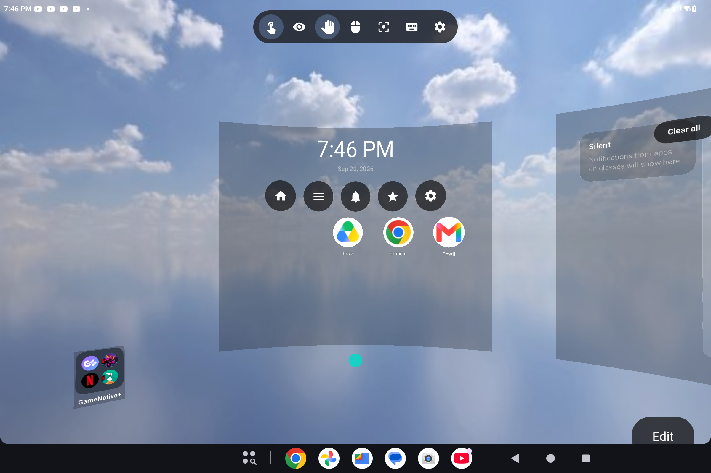
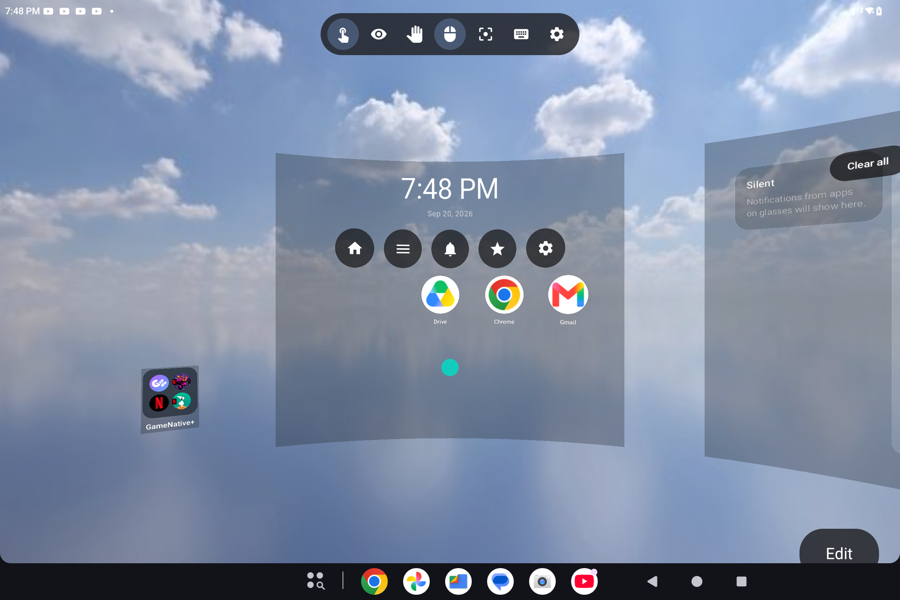
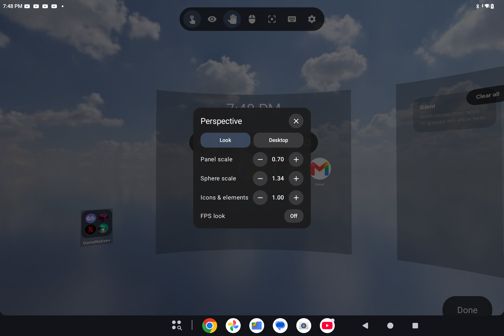
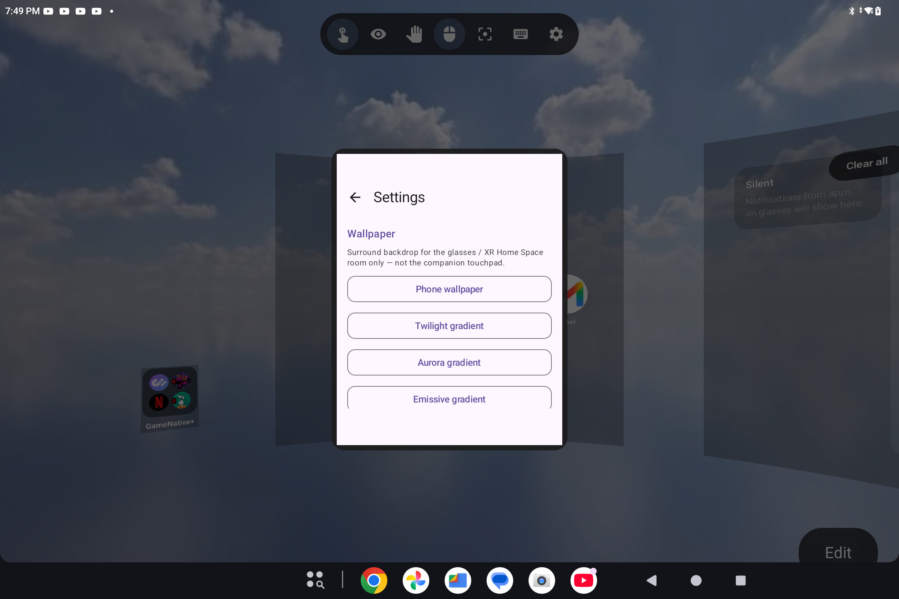
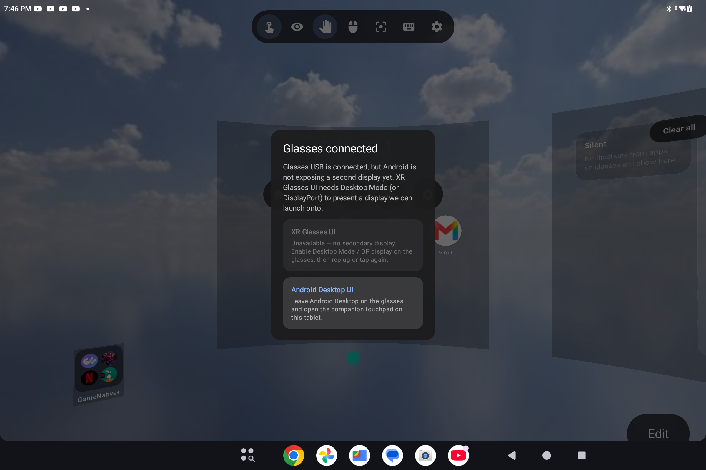

# XR Launcher 0.1.34

Spatial workspace launcher for Android XR glasses, tablets, and large-screen hosts — with the phone as a companion touchpad.

**Tag:** `v0.1.34` · **versionCode:** 35 · **minSdk:** 34

This build lands companion multitouch, tray/QS polish, Recents world-lock, wallpaper/HDRI options, and clearer host look modes on tablet.

## Highlights

### Companion touchpad
- **Apps icon** toggles All Apps on glasses (replaces the wide Close All Apps button)
- **2-finger** drag scrolls under the glasses cursor; **pinch** zooms the Home Space sphere
- **3-finger** drag pans look; **2-finger tap** right-clicks
- Toolbar icons use high-contrast tints on the dark chrome

### Tray / notifications / QS
- Deduped quick-settings chrome; brightness slider no longer trapped by a parent clickable
- Mouse-look can **scrub brightness** and a **notification scroll handle**
- Per-notification **X** dismiss hits for FPS / companion pointer

### Home Space
- Hamburger **Recents** is world-locked on the Home pane (no longer stuck to the FPS crosshair)
- Radial menu already world-locked in mouse-look (from earlier in this cycle)
- Host HUD look modes: touchpad / eye / gesture / mouse-look + recenter, keyboard, Settings

### Wallpapers & room
- Phone wallpaper on the XR room (with storage grant on Android 14+)
- Gradient + **Poly Haven HDRI** surround options in Settings
- Wallpaper stays on glasses/XR — companion touchpad stays opaque

## Screenshots (tablet host)

  

<em>Tablet Home Space — top HUD look modes, Home pane, tray notifications</em>

  

<em>Mouse-look selected on the host HUD</em>

  

<em>Edit → Perspective — panel / sphere / UI scale and FPS look toggle</em>

  

<em>Settings — surround wallpaper choices (phone wallpaper + gradients)</em>

  

<em>Glasses attach — XR Glasses UI vs Android Desktop (+ companion)</em>

## Install

1. Download **`app-release.apk`** from the GitHub Release for `v0.1.34`.
2. `adb install -r app-release.apk`
3. Enable **Accessibility → XR Launcher display pointer** for companion clicks on glasses.
4. Optional: notification listener access for the tray; write-settings for brightness scrubbing.

[Obtainium](https://github.com/ImranR98/Obtainium): GitHub · `electrikjesus/XR-Launcher` · APK filter `app-release.apk`.

## Known gaps

- Motion + FPS desk drag still awkward (**2.25c**)
- Host Settings full content audit still open (**2.29**)
- Widget touch-through and some pile polish still open

## Compare

- Previous tagged: [`v0.1.19`](https://github.com/electrikjesus/XR-Launcher/releases/tag/v0.1.19)
- Diff: https://github.com/electrikjesus/XR-Launcher/compare/v0.1.19...v0.1.34
